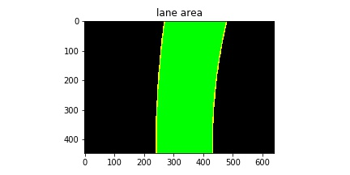

# Udacity Carnd-term1
## P4 Advanced Lane Lines
### Zheng lei
---
In this project, your goal is to write a software pipeline to identify the lane boundaries in a video from a front-facing camera on a car.

**Advanced Lane Finding Project**

The goals / steps of this project are the following:

* Compute the camera calibration matrix and distortion coefficients given a set of chessboard images.
* Apply a distortion correction to raw images.
* Use color transforms, gradients, etc., to create a thresholded binary image.
* Apply a perspective transform to rectify binary image ("birds-eye view").
* Detect lane pixels and fit to find the lane boundary.
* Determine the curvature of the lane and vehicle position with respect to center.
* Warp the detected lane boundaries back onto the original image.
* Output visual display of the lane boundaries and numerical estimation of lane curvature and vehicle position.

## [Rubric](https://review.udacity.com/#!/rubrics/571/view) Points

### Here I will consider the rubric points individually and describe how I addressed each point in my implementation.  

---


You're reading it!

## Step0 camera calibration
Image distortion occurs when a camera looks at 3D objects in the real world and transforms them into a 2D image; this transformation isn’t perfect. Distortion actually changes what the shape and size of these 3D objects appear to be. So, the first step in analyzing camera images, is to undo this distortion so that you can get correct and useful information out of them.

I start by preparing "object points", which will be the (x, y, z) coordinates of the chessboard corners in the world. Here I am assuming the chessboard is fixed on the (x, y) plane at z=0, such that the object points are the same for each calibration image.  Thus, `objp` is just a replicated array of coordinates, and `objpoints` will be appended with a copy of it every time I successfully detect all chessboard corners in a test image.  `imgpoints` will be appended with the (x, y) pixel position of each of the corners in the image plane with each successful chessboard detection.  

I then used the output `objpoints` and `imgpoints` to compute the camera calibration and distortion coefficients using the `cv2.calibrateCamera()` function.  I applied this distortion correction to the test image using the `cv2.undistort()` function and obtained this result: 

#### Provide an example of a distortion-corrected image.


---
## Step1 perspective transform , bird eye view

A perspective transform maps the points in a given image to different, desired, image points with a new perspective. The perspective transform you’ll be most interested in is a bird’s-eye view transform that let’s us view a lane from above; this will be useful for calculating the lane curvature later on. 

I define an transform using `cv2.getPerspectiveTransform`.The transform source and destination was selected mannually.
```python
def create_M():
    src = np.float32([[0, 673], [1207, 673],[480, 450], [800, 450]])
    dst = np.float32([[188, 446], [462, 446], [0, 0], [640, 0]])
    
    M = cv2.getPerspectiveTransform(src, dst)
    Minv = cv2.getPerspectiveTransform(dst, src)
    return M, Minv
```

This resulted in the following source and destination points:

| Source        | Destination   | 
|:-------------:|:-------------:| 
| 0, 673        | 188, 446      | 
| 1207, 673     | 462, 446      |
| 480, 450      | 0, 0          |
| 800, 450      | 640, 0        |

The code for my perspective transform includes a function called `trans_binary()`
```python
def trans_binary(img, M):
    img_size = (IMAGE_W, IMAGE_H)
    warped = cv2.warpPerspective(img, M, img_size)
    return warped
```

I verified that my perspective transform was working as expected by drawing the `src` and `dst` points onto a test image and its warped counterpart to verify that the lines appear parallel in the warped image.


---

## Step2 Create a mask

An image mask only keeps the region of the image defined by the polygon,formed from `vertices`. The rest of the image is set to black.I use an function called `region_of_interest`to define interest area.

```python
def region_of_interest(img, vertices):
    #defining a blank mask to start with
    mask = np.zeros_like(img)   
    
    #defining a 3 channel or 1 channel color to fill the mask with depending on the input image
    if len(img.shape) > 2:
        channel_count = img.shape[2]  # i.e. 3 or 4 depending on your image
        ignore_mask_color = (255,) * channel_count
    else:
        ignore_mask_color = 255
        
    #filling pixels inside the polygon defined by "vertices" with the fill color    
    cv2.fillPoly(mask, vertices, ignore_mask_color)
    
    #returning the image only where mask pixels are nonzero
    masked_image = cv2.bitwise_and(img, mask)
    return masked_image
```

Then I define an fuction called `road_mask` to discribe the interesting region for this project.
```python
def road_mask(img):
    imshape = img.shape
    left_bottom = (110, imshape[0])
    apex1 = (imshape[1]/2 - 70, 440)
    apex2 = (imshape[1]/2 + 70, 440)
    right_bottom = (imshape[1]-50, imshape[0])
    inner_right_bottom = (imshape[1] - 220, imshape[0])
    inner_apex2 = (imshape[1]/2 + 30,480)
    inner_apex1 = (imshape[1]/2 - 30,480)
    inner_left_bottom = (320, imshape[0])
    vertices = np.array([[left_bottom, apex1, apex2,right_bottom, inner_right_bottom,
                          inner_apex2, inner_apex1, inner_left_bottom]], dtype=np.int32)
    # Masked area
    mask_img = region_of_interest(img, vertices)
    return mask_img
```
The result of `road_mask` is like this:


## Step3 Create of thresholded binary image

To extract information from the picture. An usefull way is using HLS(hue, lightness saturation) Color Spaces. At the following segment, you can see the lane is clear in S channel. In the S picture , at the tree's shadow, there is a bright area, and the lightness channel could help us to discard this area.  

These code for seperate and display HLS channels:
```python
hls = cv2.cvtColor(img, cv2.COLOR_RGB2HLS)
H = hls[:,:,0] 
L = hls[:,:,1]
S = hls[:,:,2]

# Plot the result
f, (ax1, ax2, ax3) = plt.subplots(1, 3, figsize=(20, 6))
f.tight_layout()
ax1.imshow(H, cmap='gray')
ax1.set_title('H hue', fontsize=30)
ax2.imshow(L, cmap='gray')
ax2.set_title('L Lightness', fontsize=30)
ax3.imshow(S, cmap='gray')
ax3.set_title('S Saturation', fontsize=30)
plt.savefig("readme_img/HLS.jpg")
```
When I separate the H, L, and S channels we get the following result. In the S channel, the lane is very clear. L channel gives the information of lightness,which is also useful for seperater some useless information.


Soble operator is like the gradient function. sobel derivative in x tells us the information about the lane, especially when the saturation is low. So we can combine soblex and saturation together. Then change them into binary format.

I define a funtction called `binary_pipeline` to combine S channel and soble-x image.The threshold is very important, if the S thresh is too wide, it involved some useless information. If the S thresh is too narrow, it miss some useful information. And also I add `l_channel` as an condition.After combine these images, the function convert the image into binary format.

```python
def binary_pipeline(img, s_thresh=(190, 255), sx_thresh=(30, 100)):
    img = np.copy(img)
    # Convert to HSV color space and separate the V channel
    hsv = cv2.cvtColor(img, cv2.COLOR_RGB2HLS).astype(np.float)
    l_channel = hsv[:,:,1]
    s_channel = hsv[:,:,2]
    # Sobel x
    sobelx = cv2.Sobel(l_channel, cv2.CV_64F, 1, 0) # Take the derivative in x
    abs_sobelx = np.absolute(sobelx) # Absolute x derivative to accentuate lines away from horizontal
    scaled_sobel = np.uint8(255*abs_sobelx/np.max(abs_sobelx))
    
    # Threshold x gradient
    sxbinary = np.zeros_like(scaled_sobel)
    sxbinary[(scaled_sobel >= sx_thresh[0]) & (scaled_sobel <= sx_thresh[1]) ] = 1
    
    # Threshold color channel
    s_binary = np.zeros_like(scaled_sobel)
    s_binary[(s_channel >= s_thresh[0]) & (s_channel <= s_thresh[1])& (l_channel >= 50)] = 1
    
    # Stack each channel
    color_binary = sxbinary + s_binary
    color_binary[(color_binary >= 1) & (color_binary <= 255)] = 1
    
    return color_binary, s_binary , sxbinary
```

The result of this function is like this:


## Step4 Find lane in bird view
After the above process, we have an binary birdey view image of the lane. We want describe the lane in mathematic language.There is several methods to find the lane, and calculate the polynominal.I use the "sliding window" method. 

I first calculate histogram of the binary image. 
```
histogram = np.sum(birdeye_binary[birdeye_binary.shape[0]//2:,:], axis=0)
plt.plot(histogram)
```


Then I define an window in the bottom of the image based on the max value of the histogram. Then calculate the average position of the white points in the window, and use it as next window's center position.We only interest on the white points in windows, and use "np.polyfit" to fitting the lane.I build a `findline` function to implement the **sliding window** method,and fit the lane.

```
def findline(binary_image):
    histogram = np.sum(binary_image[binary_image.shape[0]//2:,:], axis=0)
    
    # Find the peak of the left and right halves of the histogram
    # These will be the starting point for the left and right lines
    midpoint = np.int(histogram.shape[0]/2)
    leftx_base = np.argmax(histogram[180:midpoint])+180
    rightx_base = np.argmax(histogram[midpoint:500]) + midpoint
    # Choose the number of sliding windows
    nwindows = 8
    # Set height of windows
    window_height = np.int(binary_image.shape[0]/nwindows)

    # Identify the x and y positions of all nonzero pixels in the image
    nonzero = binary_image.nonzero()
    nonzeroy = np.array(nonzero[0])
    nonzerox = np.array(nonzero[1])

    # Current positions to be updated for each window
    leftx_current = leftx_base
    rightx_current = rightx_base
    # Set the width of the windows +/- margin
    margin = 20
    # Set minimum number of pixels found to recenter window
    minpix = 40
    # Create empty lists to receive left and right lane pixel indices
    left_lane_inds = []
    right_lane_inds = []
    
    out_img = np.dstack((binary_image, binary_image, binary_image))*255
    
    # Step through the windows one by one
    for window in range(nwindows):
        # Identify window boundaries in x and y (and right and left)
        win_y_low = birdeye_binary.shape[0] - (window+1)*window_height
        win_y_high = birdeye_binary.shape[0] - window*window_height
        win_xleft_low = leftx_current - margin
        win_xleft_high = leftx_current + margin
        win_xright_low = rightx_current - margin
        win_xright_high = rightx_current + margin

        # Draw the windows on the visualization image
        cv2.rectangle(out_img,(win_xleft_low,win_y_low),(win_xleft_high,win_y_high),(0,255,0), 2) 
        cv2.rectangle(out_img,(win_xright_low,win_y_low),(win_xright_high,win_y_high),(0,255,0), 2) 
        # Identify the nonzero pixels in x and y within the window
        good_left_inds = ((nonzeroy >= win_y_low) & (nonzeroy < win_y_high) & (nonzerox >= win_xleft_low)
                          & (nonzerox < win_xleft_high)).nonzero()[0]
        good_right_inds = ((nonzeroy >= win_y_low) & (nonzeroy < win_y_high) & (nonzerox >= win_xright_low) 
                           & (nonzerox < win_xright_high)).nonzero()[0]
        # Append these indices to the lists
        left_lane_inds.append(good_left_inds)
        right_lane_inds.append(good_right_inds)
        # If you found > minpix pixels, recenter next window on their mean position
        if len(good_left_inds) > minpix:
            leftx_current = np.int(np.mean(nonzerox[good_left_inds]))
        if len(good_right_inds) > minpix:        
            rightx_current = np.int(np.mean(nonzerox[good_right_inds]))
            
    # Concatenate the arrays of indices
    left_lane_inds = np.concatenate(left_lane_inds)
    right_lane_inds = np.concatenate(right_lane_inds)

    # Extract left and right line pixel positions
    leftx = nonzerox[left_lane_inds]
    lefty = nonzeroy[left_lane_inds] 
    rightx = nonzerox[right_lane_inds]
    righty = nonzeroy[right_lane_inds] 

    # Fit a second order polynomial to each
    left_fit = np.polyfit(lefty, leftx, 2)
    
    if righty.size > 0 :
        right_fit = np.polyfit(righty, rightx, 2)
    else:
        right_fit = left_fit
        right_fit[2] = left_fit[2] + 181
    
    # Fit a second order polynomial to each
    out_img_poly = copy.deepcopy(out_img)
    ploty = np.linspace(0, IMAGE_H -1, IMAGE_H )
    left_fitx = left_fit[0]*ploty**2 + left_fit[1]*ploty + left_fit[2]
    right_fitx = right_fit[0]*ploty**2 + right_fit[1]*ploty + right_fit[2]
    
    for i in range(IMAGE_H):
        for j in range(IMAGE_W):
            if (j>= left_fitx[i]-2 and j<= left_fitx[i]+2) or (j>= right_fitx[i]-2 and j<= right_fitx[i]+2):
                out_img_poly[i,j] = (255,255,0)
    
    return left_fit,right_fit,out_img,out_img_poly
```

The output image of the funtion is like this:


## step5 Draw road area
Now,we have two 2nd order polynominal.Then we can fill the road area with color. I fill the area use "for" loop, it's efficiency is not the best. I think there could be other ways. Then I transform the birdeye view to normal view.I define a function called `draw_area` to draw an road mask.
```
def draw_area(left_poly,right_poly):
    # Generate x and y values for plotting
    ploty = np.linspace(0, IMAGE_H -1, IMAGE_H )
    left_fitx = left_poly[0]*ploty**2 + left_poly[1]*ploty + left_poly[2]
    right_fitx = right_poly[0]*ploty**2 + right_poly[1]*ploty + right_poly[2]
    mask = np.zeros(shape = (IMAGE_H,IMAGE_W,3), dtype=np.uint8)

    for i in range(IMAGE_H):
        for j in range(IMAGE_W):
            if j> left_fitx[i] and j< right_fitx[i]:
                mask[i,j] = (0,255,0)
            if (j>= left_fitx[i]-2 and j<= left_fitx[i]+2) or (j>= right_fitx[i]-2 and j<= right_fitx[i]+2):
                mask[i,j] = (255,255,0)
    return mask
```
The output image of the funtion is like this:


---
## Step 6 Road radius and Car positon

In this chapter, I build two functions to calculate car position and lane curvature. We assume the camare is mounted in the middle of the car. So the car postion is compare the diffrence between the middle of the lane and the image center.I define a function called `find_car_position` to do this.
```
def find_car_position(left_fit,right_fit):
    left_lane_pix = left_fit[0]*(IMAGE_H - 1)**2 + left_fit[1]*(IMAGE_H - 1) + left_fit[2]
    right_lane_pix = right_fit[0]*(IMAGE_H - 1)**2 + right_fit[1]*(IMAGE_H - 1) + right_fit[2]
    
    offset_pix = IMAGE_W/2.0- (left_lane_pix + right_lane_pix)/2.0
    offset_m = offset_pix*xm_per_pix
    return offset_m
```
To calculate curvature, these formular is useful, and I define a function `measuring_curverad` to calculate the value.


```
def measuring_curvature(fit):
    ploty = np.linspace(0, IMAGE_H -1, IMAGE_H )# to cover same y-range as image
    leftx = fit[0]*ploty**2 + fit[1]*ploty + fit[2]
    y_eval = np.max(ploty)
    # Fit new polynomials to x,y in world space
    fit_cr = np.polyfit(ploty*ym_per_pix, leftx*xm_per_pix, 2)
    
    # Calculate the new radii of curvature
    curverad = ((1 + (2*fit_cr[0]*y_eval*ym_per_pix + fit_cr[1])**2)**1.5) / np.absolute(2*fit_cr[0])
    if curverad > 10000:
        curverad = 10000
    return curverad
```


## Step 7 Process image pipeline
An pipeline read in the image and return an marked image.I also add intermediate image to the output.These sub-image help me to debug the program, easy to find the problems.I think it is very useful.

The pipe line have several steps:  
1. Undistort the image  
2. Build binary image using soble-x, lightness and saturation  
3. Mask the binary image
4. Transfer to birdeye view
5. Find lane in the image, fit the lane using 2nd order polynominal
6. Draw lane area in the image 
7. Resize and convert sub-image for diagnostic
8. Write comment to image
9. Calculate car position and lane curvature , and write them on image

```
def process_image_P4(image):
    #Step1 undistort
    undistort_image = undistort(image)
    
    #Step2 binary image using soblex, lightness and saturation
    binary,s_binary,sxbinary = binary_pipeline(image)
    
    #Step3 Transfer to birdeye view
    mask_binary = road_mask(binary)
    
    #Step4 Transfer to birdeye view
    birdeye_binary = trans_binary(mask_binary, M)
    
    #Step5 Find line
    left,right,slide_window,slide_window_poly = findline(birdeye_binary)
    
    #Step6 Draw lane area in the image 
    mask = draw_area(left,right)
    maskwarp = cv2.warpPerspective(mask, Minv, (1280, 720)) 
    blend = cv2.addWeighted(image,1.0,maskwarp,0.5,0.0)
    
    #Step7 resize and convert sub-image for diagnostic
    img_birdeye = transform(undistort_image,M)
    img_birdeye_resize = cv2.resize(img_birdeye,None,fx=0.8,fy =0.8)
    binary_RGB = np.dstack((binary,binary,binary))*255#convert gray to RGB
    binary_resize = cv2.resize(binary_RGB,None,fx=0.5,fy =0.5)
    slide_window_poly_resize = cv2.resize(slide_window_poly,None,fx=0.8,fy =0.8)
    birdeye_binary_RGB = np.dstack((birdeye_binary,birdeye_binary,birdeye_binary))*255#convert gray to RGB
    birdeye_binary_resize = cv2.resize(birdeye_binary_RGB,None,fx=0.8,fy =0.8)
    maskwarp_resize = cv2.resize(maskwarp,None,fx=0.5,fy =0.5)
    #add subimage to process view
    process_view = np.zeros((1080,1920,3), dtype=np.uint8)#creat empty image
    process_view.fill(200)
    process_view[10:720, 10:1280] = blend[10:720, 10:1280]
    process_view[10:350, 1300:1800] = img_birdeye_resize[0:340,0:500]
    process_view[730:1070, 10:635] = binary_resize[10:350,10:635]
    process_view[360:700, 1300:1800] = birdeye_binary_resize[0:340,0:500]
    process_view[730:1070, 1300:1800] = slide_window_poly_resize[0:340,0:500]
    process_view[730:1070, 655:1280] = maskwarp_resize[10:350,10:635]
    process_view[400:1000, 1810:1920] = name_image
    
    #Step8 write comment
    font = cv2.FONT_HERSHEY_SIMPLEX
    cv2.putText(process_view,'bird eye view ',(1310,45), font, 1,(255,255,255),2)
    cv2.putText(process_view,'sobelx + S binary ',(20,775), font, 1,(255,255,255),2)
    cv2.putText(process_view,'bird eye binary ',(1310,405), font, 1,(255,255,255),2)
    cv2.putText(process_view,'sliding window and polyfit ',(1310,775), font, 1,(255,255,255),2)
    cv2.putText(process_view,'mask warped ',(675,775), font, 1,(255,255,255),2)
    
    #Step9 car position and lane radius
    car_position = find_car_position(left,right)
    radius = np.round(measuring_curvature(left),2)
    if radius> 9999:
        radius = 'Inf'
    else:
        radius = str(radius)
    
    text_pos = 'Pos of the car: '+str(np.round((car_position),2))+ ' m'
    text_radius = 'Radius: '+ radius + ' m'
    cv2.putText(process_view,text_pos,(20,45), font, 1,(255,255,255),2)
    cv2.putText(process_view,text_radius,(20,95), font, 1,(255,255,255),2)
    
    return process_view
```

An output image of the pipeline is like below:


---

## Pipeline (video)

I use the same pipeline as above to build an video. I use `moviepy` to extract picture from video and use `process_image_P4` to return an processed image. Here's a [link to my video result](./project_video_out_720.mp4)

```
from moviepy.editor import VideoFileClip
output_name = 'test_videos_output/project_video_out_720.mp4'
clip1 = VideoFileClip('./project_video.mp4')
out_clip = clip1.fl_image(process_image_P4) #NOTE: this function expects color images!!
%time out_clip.write_videofile(output_name, audio=False)
```

---

# Discussion

#### 1. Briefly discuss any problems / issues you faced in your implementation of this project.  Where will your pipeline likely fail?  What could you do to make it more robust?

1) When I draw area at **step5** , I use two nested `for` loop. I think this method is not very efficient.

2) When I paste the sub-image to the main image in **step7**, it take me half a day to find the way. Finally, I find an easy way to paste image:
```
process_view[10:720, 10:1280] = blend[10:720, 10:1280]
```

3) I think it is very useful to display process image in the video. When the pipeline failed, I can easily find the bug. From the combo video, when I pause the frame, it clearly shows which step is wrong. Is the binary image or sliding window or poly-fitting.

4)  In the S picture , at the tree shadows, there is a bright area. I found the lightness channel could help us to discard these area.

#### 2.others
1) The pipeline perform bad on the harder video. I think my pipeline has too many preconditions , like the mask for interesting area. The program still need to optimize for better adaptation.

2) Program efficiency still need to optimize. I takes about 20 minutes to build the video.

#### 3.Thanks
Udacity's course is amazing. 
My mentor is so kind, I thanks her a lot.
Stack overflow, I can find almost everything question on this site. 

---
Zheng lei
2017 June